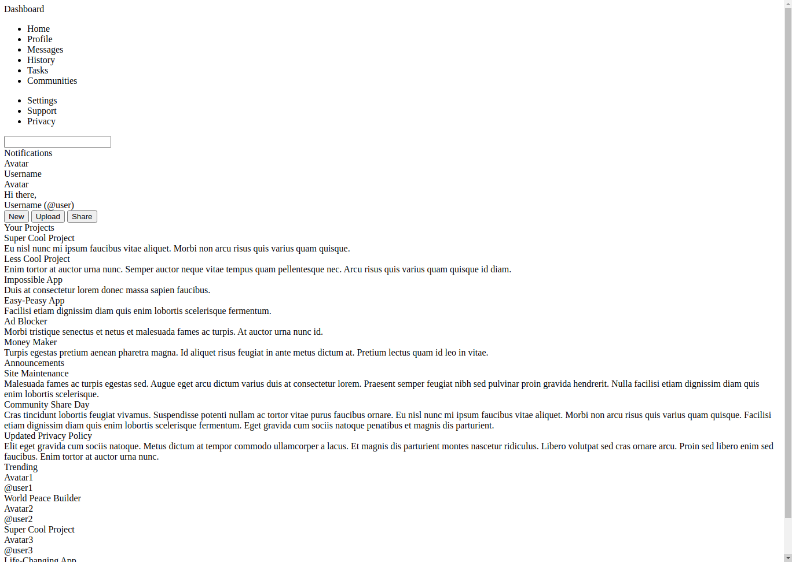
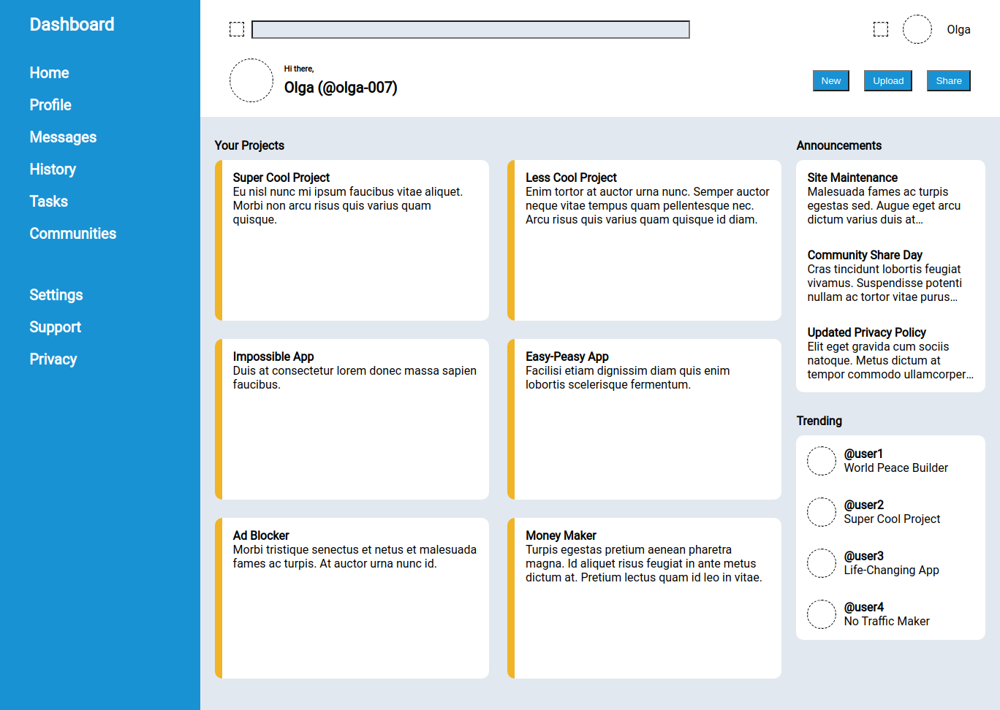
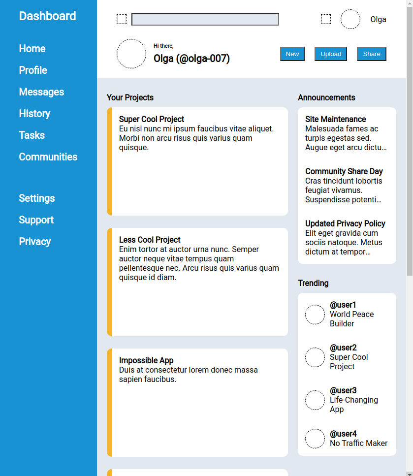

# Project "Admin Dashboard"

## Task Description
Create a dashboard webpage using CSS Grid for the majority of the layout work. A general idea for the layout:

## Version 1 
Intitial version, an unstyled HTML file.

## Version 2 
High-level styling. I made "Your Projects" section responsive, that's why it doesn't align at the bottom with the column to the right.

